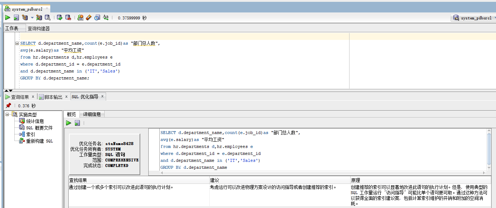

# 我的作业1
### 我的作业1

### 查询语句1：

```sql
set autotrace on

SELECT d.department_name,count(e.job_id)as "部门总人数",
avg(e.salary)as "平均工资"
from hr.departments d,hr.employees e
where d.department_id = e.department_id
and d.department_name in ('IT','Sales')
GROUP BY d.department_name;
```

### 运行结果


Cost=4,Rows=20,Predicate Information(谓词信息)中有一次索引搜索access，一次全表搜索filter.

### 查询语句2：

```sql
set autotrace on

SELECT d.department_name,count(e.job_id)as "部门总人数",
avg(e.salary)as "平均工资"
FROM hr.departments d,hr.employees e
WHERE d.department_id = e.department_id
GROUP BY d.department_name
HAVING d.department_name in ('IT','Sales');
```

### 运行结果


Cost=6,Rows=106,Predicate Information(谓词信息)中有两次索引搜索access，一次全表搜索filter.

相比较而言查询1的Cost,Rows,consistent gets均比查询2要优，所以查询1要优于查询2。

### 通过sqldeveloper的优化指导工具进行优化指导



查看详细信息


最终改进结果：


自己设计的查询语句：

```sql
SELECT d.department_name,count(e.job_id)as "部门总人数",
	avg(e.salary)as "平均工资"
	from hr.departments d
    INNER JOIN
    hr.employees e
	on d.department_id = e.department_id
	and d.department_name='IT'
    OR  d.department_name='Sales'
	GROUP BY d.department_name;
```

### 运行结果


Cost=7,Rows=116,Predicate Information(谓词信息)中有三次索引搜索access，一次全表搜索filter.

### 优化指导


