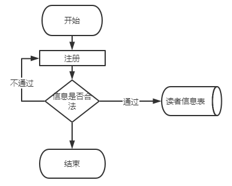

**期末项目设计报告**

| 题 目    | 基于Oracle的图书管理系统的数据库设计 |      |              |
|----------|--------------------------------------|------|--------------|
| 课程     | Oracle数据库应用                     |      |              |
| 学 院    | 信息科学与工程学院                   |      |              |
| 专 业    | 软件工程                             | 年级 | 2018级       |
| 学生姓名 | 任思绩                               | 学号 | 201810414120 |
| 指导教师 | 赵卫东                               | 职称 | 副教授       |

| **评分项**   | **评分标准**                 | **满分** | **得分** |
|--------------|------------------------------|----------|----------|
| 文档整体     | 文档内容详实、规范，美观大方 | 10       |          |
| 表设计       | 表，表空间设计合理，数据合理 | 20       |          |
| 用户管理     | 权限及用户分配方案设计正确   | 20       |          |
| PL/SQL设计   | 存储过程和函数设计正确       | 30       |          |
| 备份方案     | 备份方案设计正确             | 20       |          |
| **得分合计** |                              |          |          |

2021 年 6 月 10 日

目录

目录

[1、系统概述	3](#_Toc74338933)

[2、功能需求分析	4](#_Toc74338934)

>   [2.1	 功能概述	4](#_Toc74338935)

>   [2.1.1	管理员信息管理	4](#_Toc74338936)

>   [2.1.2	书籍信息管理	5](#_Toc74338937)

>   [2.1.3	读者信息管理	5](#_Toc74338938)

>   [2.1.4	借阅管理	6](#_Toc74338939)

>   [2.1.5	查看信息	6](#_Toc74338940)

>   [2.2	 需求分析图	7](#_Toc74338941)

>   [2.2.1	功能分析图	7](#_Toc74338942)

>   [2.2.2流程图	8](#_Toc74338943)

[3、概念结构设计	10](#_Toc74338944)

>   [3.1	 E-R图	10](#_Toc74338945)

[4、系统结构设计	12](#_Toc74338946)

>   [4.1	 概念模型	12](#_Toc74338947)

>   [4.2	 逻辑模型	12](#_Toc74338948)

>   [4.3	 物理模型	14](#_Toc74338949)

[5、表设计	15](#_Toc74338950)

[6、用户管理	21](#_Toc74338951)

>   [6.1 用户管理	21](#_Toc74338952)

>   [6.1.1预定义用户	21](#_Toc74338953)

>   [6.1.2用户属性	22](#_Toc74338954)

[7、PL/SQL设计	24](#_Toc74338955)

>   [7.1	 关于PL/SQL的概念	24](#_Toc74338956)

>   [7.2	 编写PL/SQL语句实现管理员查询图书记录的过程：	24](#_Toc74338957)

[8、备份方案	27](#_Toc74338958)

>   [8.1	 操作流程	27](#_Toc74338959)

[9、总结	34](#_Toc74338960)

# 1、系统概述 

本课题针对当前我国图书借阅管理多数采用人工管理的现状以及即使采用了计算机图书管理系统却不能完全满足本单位图书管理的需要的实际情况出发，对图书管理业务经过详细的系统调查，开发出的操作简单而且方便实用的一个图书借阅管理系统，以适应新时代发展的需要。本系统主要实现对图书馆信息的管理，主要功能为管理有关读者、图书、借阅、查询、和删除管理员的信息等。可以帮助图书馆管理员和读者更加方便地管理图书和借阅图书。本系统使用Oracle数据库，主要使用sql语句实现开发管理。

# 2、功能需求分析

图书馆管理信息系统的功能模块图

## 2.1 功能概述

本图书管理系统适用于校园等小型的图书馆使用，它的主要任务是建立详细的可借阅读者的信息（可表现为一张借阅卡，或者校园卡）以及图书馆内所有的图书种类以及对应书籍的记录。并可以对借阅者和所借书籍进行登记，方便图书管理员能及时查看馆内书刊信息以及对借书以及还书做出操作。

### 2.1.1 管理员信息管理

管理员信息管理：管理员是本系统的管理者，具有最高权限，对图书和读者有添加，修改和删除等功能。但管理员只能修改自己的信息，不能添加或删除自己的信息。要想添加和删除管理员必须到数据库中去操作表结构。

### 2.1.2 书籍信息管理

1）新增书籍。图书管理员对新增的入库文献资料按规定进行编目、编录、加工、建库。对每本图书、杂志要登记其基本信息，包括图书名称、图书作者、ISBN号、出版地、出版社、出版时间、字数、单价、内容简介、所属分类号，馆藏地、入库时间等。

2）书籍信息维护。图书管理员可以对入库的书籍信息进行修改，或是删除该书籍信息，如采购书籍册数。

3）书籍类别管理。新增书籍按照中图法分类规则进行分类。

### 2.1.3 读者信息管理

1）新增读者。图书管理员增加新增的读者信息。

2）读者信息维护。图书管理员对于所有读者的信息进行维护，如姓名，学号，借阅书籍的借阅情况，归还书籍情况，信誉情况管理。

3）借阅历史查看。图书管理员对于读者借阅历史的查看，如借阅的书籍种类，书籍编号，书籍名，借阅的时间，归还时间等等的查看。

### 2.1.4 借阅管理

借阅管理：主要是借阅权限的管理，部分重要书籍需要一定的权限才能够借阅和查看，对于个别有逾期未还书籍，损坏书籍，丢失书籍历史记录的读者进行一定的借阅限制。

### 2.1.5 查看信息

1）书籍信息查询：对于书籍的具体详细信息的查询功能。

2）读者信息查询：对于读者的具体详细信息的查询功能。

3）借阅信息查询：对于借阅的具体详细信息的查询功能。

## 2.2 需求分析图

### 2.2.1 功能分析图

### 2.2.2流程图

>   读者注册

>   

>   读者登录

>   管理员管理读者

# 3、概念结构设计

## 3.1 E-R图

上图是该图书管理系统总E-R图，该系统涉及的实体集有：
学生实体集：具有属性用户名、密码、学号，姓名，性别，院系、班级、电话

图书实体集：具有属性图书ISBN编号、图书书名、作者、出版社、定价、图书类别、库存

管理员实体集：具有属性用户名、密码、姓名、加入时间
一个学生可以借阅和归还多本图书，所以学生和图书之间的联系为1:n的联系。

一个管理员可以对多本图书进行管理，图书管理员可以有多个，所以管理员和图书之间的联系为m:n的联系。

一个管理员可以对多个读者进行管理，图书管理员可以有多个，所以管理员和学生之间的联系为m:n的联系。

# 4、系统结构设计

## 4.1 概念模型

## 4.2 逻辑模型

在得出概念结构设计的E-R图后，下一步的任务就是吧概念结构设计中的E-R模型转换为具体的数据库管理系统支持的组织层数据模型，也就是导出特定的数据库管理系统可以处理的数据库逻辑结构，由于在概念结构设计中我们就得出了若干个关系模式，因此在逻辑结构设计要做的就是把各个关系模式做一遍规范化处理，以减少冗余。以下关系模式均已规范化到第三范式。

图书表（图书编号，图书类别编号，书名，出版日期，作者，出版社，ISBN

号，价格）

图书类别表（类别编号，类别名称，类别解释）

借阅者表（借阅者编号，借阅等级，姓名，性别，照片，电话，已借图书）

借阅者类别表（借阅等级，等级名称，最大可借图书数，最长借阅期限）

管理员表（管理员编号，姓名，性别，登陆密码，电话，照片）

罚金表（罚金级别，罚金名称，罚款说，罚金数量）
借书记录表（借阅者编号，图书编号，借书时间，还书期限，押金）

还书记录表（借阅者编号，图书编号，还书时间，退款）
罚款表（借阅者编号，罚款类别，已缴罚款，罚款原因）

## 4.3 物理模型

# 5、表设计

Oracle创建表空间概念：

oracle 数据库就是指的oracle 整体，

oracle建立好以后，实际上oracle是一个一个的DBF文件，然后N个DBF文件组成一个表空间

例如：

数据库jack，

jack下用户使用的表空间有3个： users , abc, jacc

其中

users由d:\\1.dbf组成

abc由d:\\11.dbf d:\\22.dbf组成

jacc 由 d:\\jacc.dbf组成

你建的表可以选择放在这3个表空间的任意一个里（如果不写，就放在你这个用户的默认表空间里，一般都是users，这个表空间是系统自己建立的）

临时表空间你也可以用，但是只能将临时表放在里面，临时表空间主要放置一些临时数据，比如你查询一个复杂的sql语句，系统会将中间数据放在临时表空间里暂存

临时表空间会自己删除（可以选择会话结束就删除）

smallfile tablespace:小文件表空间是创建数据库的默认选项。

maxsize unlimited 表空间大小最大值没有限制

segment space management auto:表示段空间管理为自动

索引：把表数据和索引分离，分别存储在各自的表空间/物理磁盘上。在检索过程中，oracle就可以在不同的表空间中分别并行检索索引键值和数据，提高查询效率。

查看所有已创建的表空间及其对应的数据文件：select
file\_name,tablespace\_name,status from dba_data_files;

insert into shoes(picId) values('524811')

查询数据字典：

select tablespace\_name,status from dba_tablespaces;

alter tablespace zq tablespace group tbs_temp_group;

alter tablespace b tablespace group tbs_temp_group;

select \* from dba_tablespace_group

reuse:重用制定路径下原有的文件。

blocksize：数据块的大小，默认为：8kb

logging:将日志写入日志文件。

online,offline 联机脱机

extent management local 区管理本地化

segment space management 段空间管理方式

flashback 表空间是否可闪回

当表空间使用本地管理且段空间为字段管理时，表空间才能使用大文件表空间。（本地管理的撤销表空间和临时表空间除外。）

quota unlimited on tbs_main 表示用户在tbs_main上可使用的限额无限制。

account unlimited on tbs_main 创建的用户状态为未锁。

SET SERVEROUTPUT ON; ，只有将serveroutput变量设为on后，信息才能显示在屏幕上。

/\*第1步：创建临时表空间 \*\*/

create temporary tablespace user_temp

tempfile 'D:\\oracle\\oracledata\\Oracle12C\\user_temp.dbf'

size 50m

autoextend on

next 50m maxsize 20480m

extent management local;

/\*第2步：创建数据表空间 \*/

create tablespace user_data

logging /\*logging 是对象的属性，创建数据库对象时，oracle
将日志信息记录到练级重做日志文件中。代表空间类型为永久型 \*/

datafile ' D:\\oracle\\oracledata\\Oracle12C\\user_data.dbf'

size 50m

autoextend on /\*autoextend on 表空间大小不够用时自动扩展\*/

next 50m maxsize 20480m /\*next 50m 自动扩展增量为50MB \*/

extent management local; /\*extent management local 代表管理方式为本地\*/

/\*第3步：创建用户并指定表空间 \*/

create user username identified by password

default tablespace user_data

temporary tablespace user_temp;

/\*第4步：给用户授予权限 \*/

grant connect,resource,dba to username;

通过之前的概念结构设计，逻辑结构设计，物理结构设计得出来的模型可以知道，本图书管理系统大概有十张表，这些表从业务角度来分，主要有以下三类：
（1）与书库相关的表。包括图书表

（2）与系统角色相关的表，包括借阅者表，管理员表
（3）与案例业务相关的表，借书表，还书表。

除了这些表外，其他都是些参数类型的表。在我们的案例中，本系统是面向小型图书馆的。下面我们以一个借阅人数为5000，藏书量为12000本的图书馆为例。有700个借阅者需要建立借阅信息，12000本图书需要建立图书信息。预设20位管理员。粗略估算一下数据表空间为2G，索引表也设为4G，临时表空间设为900M。由于本系统大多数操作都是通过管理员进行的，并发性不高，所以回退表空间不需要很大，回退表空间就设为900M。

综上所述，本案例需要创建一个数据表空间，一个索引表空间，一个临时表空间并将回退表空间扩充，为其增加一个数据文件。

建立表空间代码：

create tablespace libsys_data

datafile ' D:\\oracle\\oracledata\\Oracle12C\\libsys_data.dbf'

size 4096m

autoextend on next 10m;

create tablespace libsys_idx

datafile ' D:\\oracle\\oracledata\\Oracle12C\\libsys_idx.dbf'

size 4096m

autoextend on next 10m;

# 6、用户管理

## 6.1 用户管理 

用户是数据库的使用者和管理者，Oracle通过设置用户及安全属性来控制用户对数据库的访问。Oracle的用户分两类，一类是创建数据库时系统预定义的用户，一类是根据应用由DBA创建的用户。

### 6.1.1预定义用户

在oracle创建时创建的用户，我们称为预定义用户，预定义用户根据作用不同分为3类：

管理员用户：包括SYS,SYSTEM,SYSMAN,DBSNMP等。SYS是数据库中拥有最高权限的管理员，可以启动、关闭、修改数据库，拥有数据字典；SYSTEM是一个辅助的数据库管理员，不能启动和关闭数据库，但是可以进行一些管理工作，如创建和删除用户；SYSMAN是OEM的管理员，可以对OEM进行配置和管理；DBSNMP用户是OEM代理，用来监视数据库的。以上这些用户都不能删除。

示例方案用户：在安装Oracle或使用odbc创建数据库时，如果选择了”示例方案”，会创建一些用户，在这些用户对应的schema中，有产生一些数据库应用案例。这些用户包括：BI、HR、OE、PM、IX、SH等。默认情况下，这些用户均为锁定状态，口令过期。

内置用户：有一些Oracle特性或Oracle组件需要自己单独的模式，因此为他们创建了一些内置用户。如APEX_PUBLIC_USER、DIP等。默认情况下，这些用户均为锁定状态，口令过期。

此外还有2个特殊的用户SCOTT和PUBLIC，SCOTT是一个用于测试网络连接的用户，PUBLIC实际是一个用户组，数据库中任何用户都属于该用户组，如果要为数据库中的全部用户授予某种权限，只需要对PUBLIC授权即可。

### 6.1.2用户属性

在创建用户时，必须使用安全属性对用户进行限制，用户的安全属性主要包括：

用户名：在同一个数据库中，用户名是唯一的，并且不能与角色名相同；

用户身份认证：Oracle采用多种方式进行身份认证，如数据库认证、操作系统认证、网络认证等；

默认表空间：用户创建数据库对象时，如果没有显式指明存储在哪个表空间中，系统会自动将该数据库对象存储在当前用户的默认表空间，在Oracle
11g中，如果没有为用户指定默认表空间，则系统将数据库的默认表空间作为用户的默认表空间；

临时表空间：临时表空间分配与默认表空间相似，如果不显式指定，系统会将数据库的临时表空间作为用户的临时表空间；

表空间配额：表空间配额限制用户在永久表空间中可以使用的存储空间的大小，默认新建用户在表空间都没有配额，可以为每个用户在表空间上指定配额，也可授予用户UMLIMITED
TABLESPACE系统权限，使用户在表空间的配额上不受限制。不需要分配临时表空间的配额；

概要文件：每个用户必须具有一个概要文件，从会话级和调用级两个层次限制用户对数据库系统资源的使用，同时设置用户的口令管理策略。如果没有为用户指定概要文件，Oracle将自动为用户指定DEFAULT概要文件；

设置用户的默认角色

账户状态：创建用户时，可以设定用户的初始状态，包括口令是否过期和账户是否锁定等。

通过前面的需求分析可以知道，系统主要有两个系统角色，分别是管理员和借阅者，管理员有很多种权限，可以对除管理员表外的所有表进行增删改查的操作，而借阅者的权限比较低，只能进行一些针对特殊表的查找操作，例如，当借阅者想查询图书馆有没有自己想要的书可以对书库表进行查询，想知道自己的借阅记录可以查询借阅记录表。

创建用户，权限角色管理代码：

create user C\#\#Reader identified by 123456;

create user C\#\#Operater identified by 234567;

create role C\#\#borrow;

create role C\#\#sale;

grant C\#\#borrow to C\#\#Reader;

grant C\#\#sale to C\#\#Operater;

grant create session, create table to C\#\#Reader;

grant connect,resource to C\#\#Operater;

# 7、PL/SQL设计

## 7.1 关于PL/SQL的概念

PL/SQL是 Procedure Language & Structured Query Language
的缩写。PL/SQL是对SQL语言存储过程语言的扩展。从ORACLE6以后，ORACLE的RDBMS附带了PL/SQL。它现在已经成为一种过程处理语言，简称PL/SQL。目前的PL/SQL包括两部分，一部分是数据库引擎部分；另一部分是可嵌入到许多产品（如C语言，JAVA语言等）工具中的独立引擎。可以将这两部分称为：数据库PL/SQL和工具PL/SQL。两者的编程非常相似。都具有编程结构、语法和逻辑机制。工具PL/SQL另外还增加了用于支持工具（如ORACLE
Forms）的句法，如：在窗体上设置按钮等。

## 7.2 编写PL/SQL语句实现管理员查询图书记录的过程：

BEGIN

FOR i IN 1..50000 LOOP

INSERT INTO BOOK ( "BOOKID","CLASSID","BOOKNAME" ) VALUES ( 1,'pei','bo' );

END LOOP;

COMMIT;

END;

BEGIN

FOR i IN 1..50000 LOOP

INSERT INTO "MANMER" ( "ID" ,"NAME" ,"SEX" ) VALUES ( 1,'pei','bo' );

END LOOP;

COMMIT;

END;

BEGIN

FOR i IN 1..50000 LOOP

INSERT INTO "READER" ( "READERID","READERCLASS","READERNAME" ) VALUES (
1,'pei','bo' );

END LOOP;

COMMIT;

END;

BEGIN

FOR i IN 1..50000 LOOP

INSERT INTO "READERCLASS" ( "READERCLASS","READERCLASSNAME","MAXBORROW" ) VALUES
( 1,'pei','bo' );

END LOOP;

COMMIT;

END;

BEGIN

FOR i IN 1..50000 LOOP

INSERT INTO "CLASSIDTABLE" ( "CLASSID" ,"CLASSNAME","CLASSEXPLAIN" ) VALUES (
1,'pei','bo' );

END LOOP;

COMMIT;

END;

# 8、备份方案

## 8.1 操作流程

1）查看全库所有需要备份的相关文件

\$sqlplus sys/123@202.115.82.8/oralce as sysdba

SELECT NAME FROM v\$datafile

UNION ALL

SELECT MEMBER AS NAME FROM v\$logfile

UNION ALL

SELECT NAME FROM v\$controlfile;

2）查看一个pdb数据库的数据文件，以ly为例

\$sqlplus system/123@202.115.82.8/ ly

SELECT NAME FROM v\$datafile

UNION ALL

SELECT MEMBER AS NAME FROM v\$logfile

UNION ALL

SELECT NAME FROM v\$controlfile;

3）sys用户登录

必须以专用模式登录： \$rman target sys/123@202.115.82.8/orcl:dedicated

4）全库0级备份(只作一次)

run{

configure retention policy to redundancy 1;

configure controlfile autobackup on;

configure controlfile autobackup format for device type disk to
'/home/student/rman_backup/%F';

configure default device type to disk;

crosscheck backup;

crosscheck archivelog all;

allocate channel c1 device type disk;

allocate channel c2 device type disk;

allocate channel c3 device type disk;

backup incremental level 0 database format
'/home/student/rman_backup/level0_%d_%T_%U.bak';

report obsolete;

delete noprompt obsolete;

delete noprompt expired backup;

delete noprompt expired archivelog all;

release channel c1;

release channel c2;

release channel c3;

}

5）全库1级增量备份

run{

configure retention policy to redundancy 1;

configure controlfile autobackup on;

configure controlfile autobackup format for device type disk to
'/home/student/rman_backup/%F';

configure default device type to disk;

crosscheck backup;

crosscheck archivelog all;

allocate channel c1 device type disk;

allocate channel c2 device type disk;

allocate channel c3 device type disk;

backup incremental level 1 database format
'/home/student/rman_backup/level1_%d_%T_%U.bak';

report obsolete;

delete noprompt obsolete;

delete noprompt expired backup;

delete noprompt expired archivelog all;

release channel c1;

release channel c2;

release channel c3;

}

（1）全库完全恢复

oracle登录linux,不是普通用户,dedicated专用连接模式

需要全库停机，需要oracle用户

sys登录到oralce，查看全库的数据文件

\$ sqlplus / as sysdba

SQL\> select file_name from dba_data_files;

\- 全库停机

\$rman target /

RMAN\> shutdown immediate; 或者 shutdown abort;

RMAN\> exit

\- 数据文件改名，模拟文件损失

\$mv /home/student/pdb_ly/pdbtest_users02_1.dbf
/home/student/pdb_ly/pdbtest_users02_1.dbf2

\- 全库恢复

\$rman target /

RMAN\> startup mount;

RMAN\> restore database;

RMAN\> recover database;

RMAN\> alter database open;

（2）单库完全恢复/不完全恢复

普通用户登录linux,dedicated专用连接模式

不需要全库停机，只需要待恢复pdb停机，不需要oracle用户

前提是已经作了全库备份或者ly的单独备份

假设ly数据库中有hr用户，hr用户中有表mytable

system登录到ly，查看ly的数据文件

\$ sqlplus system/123@202.115.82.8/ly

SQL\> select file_name from dba_data_files;

SQL\> select \* from hr.mytable;

SQL\> select to\_char(sysdate,'yyyy-mm-dd hh24:mi:ss') as currentdate from dual;

SQL\> update hr.mytable set id=id+1;

SQL\> commit;

SQL\> select \* from hr.mytable;

SQL\> select to\_char(sysdate,'yyyy-mm-dd hh24:mi:ss') as currentdate from dual;

SQL\> exit;

关闭ly数据库

\$rman target sys/123@202.115.82.8/orcl:dedicated

RMAN\> alter pluggable database ly close;

RMAN\> exit;

数据文件改名，模拟文件损失

\$mv -f /home/student/pdb_ly/pdbtest_users02_1.dbf
/home/student/pdb_ly/pdbtest_users02_1.dbf2

选项1：单库完全恢复

\$rman target sys/123@202.115.82.8/orcl:dedicated

RMAN\> restore pluggable database ly;

RMAN\> recover pluggable database ly;

RMAN\> alter pluggable database ly open;

RMAN\> exit;

完全恢复成功后，hr用户登录ly，

\$ sqlplus hr/123@202.115.82.8/ly

SQL\> select \* from mytable;

选项2：单库不完全恢复,恢复到update语句之前的状态，即恢复到2021-04-27
08:02:24时刻的数据

\$rman target sys/123@202.115.82.8/orcl:dedicated

RMAN\> restore pluggable database ly;

RMAN\> recover pluggable database ly until time "to\_date('2021-04-27
08:02:24','yyyy-mm-dd hh24:mi:ss')" AUXILIARY DESTINATION '/home/student/zwd';

RMAN\> alter pluggable database ly open resetlogs;

RMAN\>exit

不完全恢复成功后，hr用户登录ly，

\$ sqlplus hr/123@202.115.82.8/ly

SQL\> select \* from mytable;

# 9、总结

通过此次的项目实验制作，了解到了更多oralce的相关知识，更加熟悉和运用了很多的数据库相关的知识，也更多的明白了自己需要学习的东西还要很多，也有很多知识是不懂的，借由该课程也学会了很多git的相关操作与对github的使用方式了解更多。学到了很多，感谢老师的耐心指导与认真教学。
